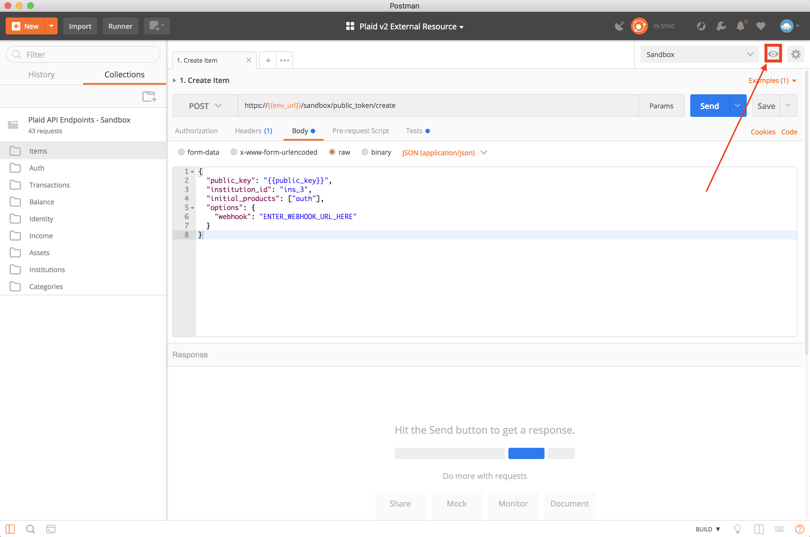

# plaid-postman

## Introduction 

Welcome to the Postman Collections Quickstart Guide! This quickstart is a step-by-step guide that will get you up and running with Postman and the Plaid’s Postman [collection](https://www.getpostman.com/docs/v6/postman/collections/intro_to_collections). 

If you haven't already done so, please [download](https://www.getpostman.com/apps) the Postman app.
		
We created this in order to make it as simple as possible for you to make requests to Plaid’s API and visualize the responses in a friendly format. Please make sure to read all the steps. There aren’t many, so we promise the setup will be quick!

If you would like to learn more about each of our endpoints, please refer to the API [documentation](https://plaid.com/docs/api).

## [Plaid API](https://www.plaid.com/docs)

Click the button below to start testing Plaid Sandbox endpoints using Postman! Please make sure the `Sandbox` environment is selected in the upper right hand corner of the screen and that the `public_key`, `client_id`, and `secret` are set. These values can be found on your Plaid [dashboard](https://dashboard.plaid.com/account/keys).

[](https://app.getpostman.com/run-collection/9a5bdac107f4d21edbc1#?env%5BSandbox%5D=W3sia2V5IjoiY2xpZW50X2lkIiwidmFsdWUiOiJZT1VSX0NMSUVOVF9JRCIsImVuYWJsZWQiOnRydWV9LHsia2V5IjoicHVibGljX2tleSIsInZhbHVlIjoiWU9VUl9QVUJMSUNfS0VZIiwiZW5hYmxlZCI6dHJ1ZX0seyJrZXkiOiJzZWNyZXRfa2V5IiwidmFsdWUiOiJZT1VSX1NFQ1JFVF9LRVkiLCJlbmFibGVkIjp0cnVlfSx7ImtleSI6InB1YmxpY190b2tlbiIsInZhbHVlIjoiIiwiZW5hYmxlZCI6dHJ1ZX0seyJrZXkiOiJhY2Nlc3NfdG9rZW4iLCJ2YWx1ZSI6IiIsImVuYWJsZWQiOnRydWV9LHsia2V5IjoiYXNzZXRfcmVwb3J0X3Rva2VuIiwidmFsdWUiOiIiLCJlbmFibGVkIjp0cnVlfSx7ImtleSI6ImVudl91cmwiLCJ2YWx1ZSI6InNhbmRib3gucGxhaWQuY29tIiwiZW5hYmxlZCI6dHJ1ZX0seyJrZXkiOiJhY2NvdW50X2lkIiwidmFsdWUiOiIiLCJlbmFibGVkIjp0cnVlfV0=)

* **Items** 
  * **Create Item [Sandbox Only]** - Creates an Item by generateing a public token. This endpoint only works in the Sandbox environment. Items can only be created through Plaid Link in the development and production environments.
  * **Exchange Token** - Exchanges a public token for an access token.
  * **Retrieve Item** - Retrieves information about an Item.
  * **Retrieve an Item's Accounts** - Retrieves all available accounts for an Item.  
  * **Rotate Access Token** - Returns a new access token and invalidates the old one.
  * **Update an Item's Webhook** - Updates an Item's webhook url. 
  * **Simulate ITEM_LOGIN_REQUIRED [Sandbox Only]** - Sets an Item in an ITEM_LOGIN_REQUIRED state. Check our [Errors](https://plaid.com/docs/#errors-overview) section in our docs for more information.
  * **Remove Item** - Deletes an Item using its access token.

* **Auth** 
  * **Retrieve Auth** - Retrieves the bank account and routing numbers associated with an Item’s checking and savings accounts, along with high-level account data and balances.

* **Transactions** 
  * **Retrieve Transactions** - Retrieves user-authorized transaction data for credit and depository-type Accounts. Transaction data is standardized across financial institutions, and in many cases transactions are linked to a clean name, entity type, location, and category. Similarly, account data is standardized and returned with a clean name, number, balance, and other meta information where available.

* **Balance**
  * **Retrieve Balance** - Retrieves the real-time balance for each of an Item’s accounts.

* **Identity**
  * **Retrieve Identity** -  Retrieves various account holder information on file with the financial institution, including names, emails, phone numbers, and addresses.

* **Income**
  * **Retrieve Income** - Retrieves information pertaining to a Item’s income. In addition to the annual income, detailed information will be provided for each contributing income stream (or job).

* **Assets**
  * **Create Asset Report** - Creates an Asset Report.
  * **Retrieve an Asset Report (JSON)** - Retrieves an Asset Report in JSON.
  * **Retrieve an Asset Report (PDF)** - Retrieves an Asset Report in PDF.
  * **Create Audit Copy** - Plaid can provide an Audit Copy of any Asset Report directly to a participating third party on your behalf. This endpoint creates that Audit Copy.
  * **Remove Asset Report** - Removes an Asset Report.
  * **Remove Audit Copy** - Removes an Audit Copy.
  * **Refresh Asset Report** - Create a new Asset Report based on the old one, but with the most recent data available from the financial institution(s).

* **Institutions**
  * **Search Institution by Name** - Retrieves information about a specific institution by name.
  * **Search Institution by ID** - Retrieves information about a specific institution by ID. 
  * **Retrieve Institution List** - Retrieves a list of all supported institutions.

* **Categories** 
  * **Retrieve Categories** - Retrieves detailed information on categories returned by Plaid. This endpoint does not require authentication.

## Useful Tools
[Webhook Tester](https://webhook.site/) is a great tool for receiving webhook calls. Generate a webhook url on this site and use that url for any Postman requests that require you to specify a webhook url. You can go on Webhook Tester to see a list of all requests being made to that url.

## Important Note
The `/public_token/create` endpoint is only available in the `sandbox` environment. It exists only for testing purposes and simulates an Item Creation via the Plaid Link module. Items cannot be created directly via an endpoint for the `development` and `production` environments and can only be created through Plaid Link.

