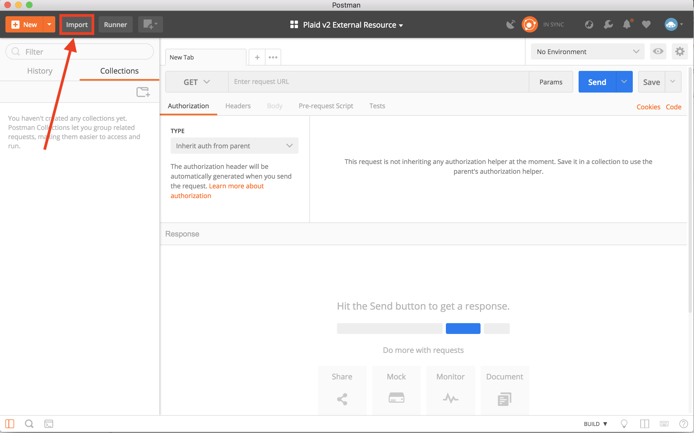
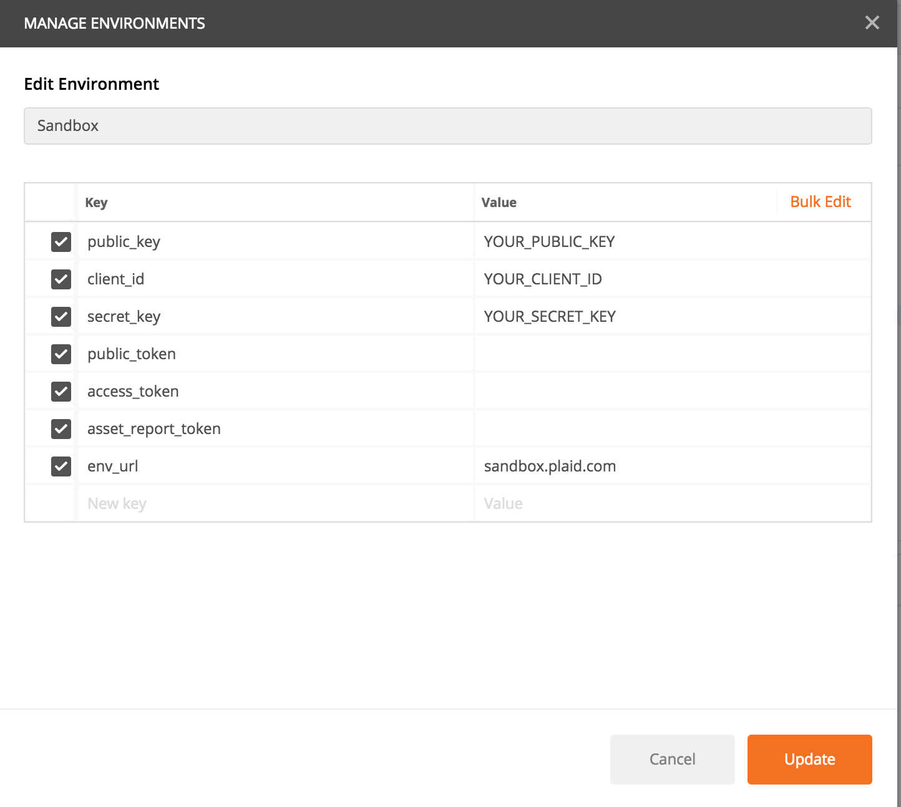
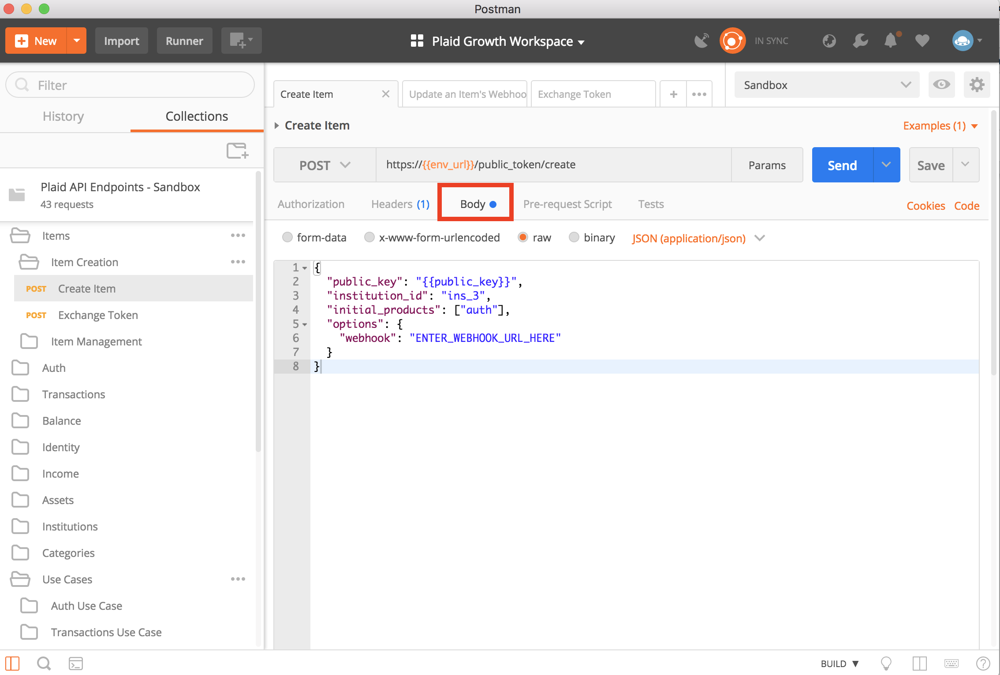

# plaid-postman

## Introduction 

Welcome to the Postman Collections Quickstart Guide! This quickstart is a step-by-step guide that will get you up and running with Postman and the Plaid’s Postman [collection](https://www.getpostman.com/docs/v6/postman/collections/intro_to_collections). 

If you haven't already done so, please [download](https://www.getpostman.com/apps) the Postman app.
		
We created this in order to make it as simple as possible for you to make  requests to Plaid’s API and visualize the responses in a friendly format. Please make sure to read all the steps. There aren’t many, so we promise the setup will be quick!

If you would like to learn more about each of our endpoints, please refer to the API [documentation](https://plaid.com/docs/api).

## Initial Setup

1. Clone or download the repo so you have all the files. After you download the Postman app, import your **‘Plaid API Endpoints Collection.json’** and **‘Sandbox Environment.json’** files. Make sure the hidebar is not hidden!

2. After importing both the collection and the environment, make sure the Sandbox environment is selected in order to set your environment variables. This can be done by clicking on the eye icon as shown below and then clicking on ‘edit’. You can find your `public_key`, `client_id`, and `secret` on your Plaid [dashboard](https://dashboard.plaid.com/account/keys). Leave the `env_url` as it is. Please input your variables under the "Current Value" fields. 

3. In the ‘Body’ tab, input values as necessary. From here on out, anything surrounded by double curly brackets {{ }} will be replaced by the value of its respective environment variable. For example, {{client_id}} will take on the value of your client_id key that was set earlier in step 2. 

Anything in CAPS_SEPARATED_BY_UNDERSCORES means that you have to manually enter the value in the body. For example, when you see ENTER_WEBHOOK_URL, you must add a valid webhook url such as ‘https://randomwebdomain.com/webhook’. 

4. You’re all set! You can now start sending requests to the Plaid server using Postman. Just choose an endpoint and click ‘Send’ and you will receive a response from Plaid.

## Examples
You can see pre-written example requests & responses for each endpoint by clicking on the ‘examples’ dropdown.

## Useful Tools
[Webhook Tester](https://webhook.site/) is a great tool for receiving webhook calls. Generate a webhook url on this site and use that url for any Postman requests that require you to specify a webhook url. You can go on Webhook Tester to see a list of all requests being made to that url.

## Important Note
The `/public_token/create` endpoint is only available in the `sandbox` environment. It exists only for testing purposes and simulates an Item Creation via the Plaid Link module. Items cannot be created directly via an endpoint for the `development` and `production` environments and can only be created through Plaid Link.

